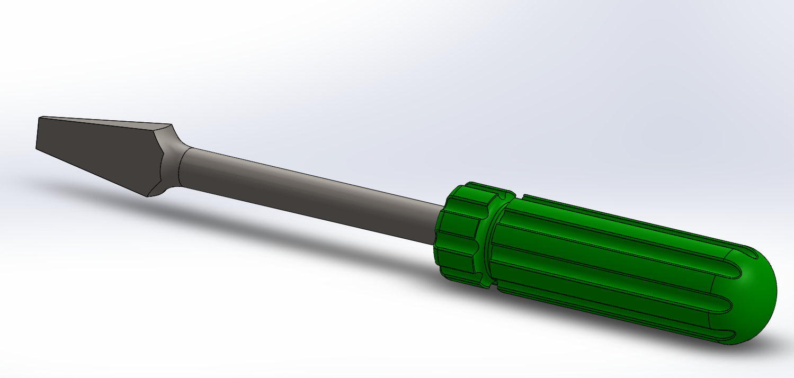

# Part-drawing-1-SW
3D Screwdriver Model — SolidWorks Project
Overview

This project features a high-fidelity 3D model of a Flathead Screwdriver, designed and rendered in SolidWorks.
The model focuses on achieving industrial-grade accuracy, ergonomic grip design, and realistic material representation for both the blade and the handle. Moreover the design is fully defined.

Key Features

Precision Modeling:

Detailed shaft and flathead tip dimensions based on real-world standards.

Ergonomic Handle Design:

Grip pattern optimized for usability and comfort, featuring deep recesses and rounded edges.

Material Realism:

Metallic shaft with smooth chrome-like finish. Polymer-based green handle with subtle gloss and surface texture.

High-Quality Rendering:

Rendered with studio-like lighting to highlight contours and textures for presentation-ready visualization.

Applications

This model is ideal for:

Product Design Prototypes,
Assembly Demonstrations,
Educational Purposes,
Portfolio Enhancement.
---

> Note:
This model was created to demonstrate precision 3D modeling skills using SolidWorks, focusing on both aesthetics and manufacturing realism.

---

Thank You for Viewing!

## File Include
- 'project01_nishchay.  SLDPRT' -
solidworks part file
## License
this project is licensed under the MIT license.

