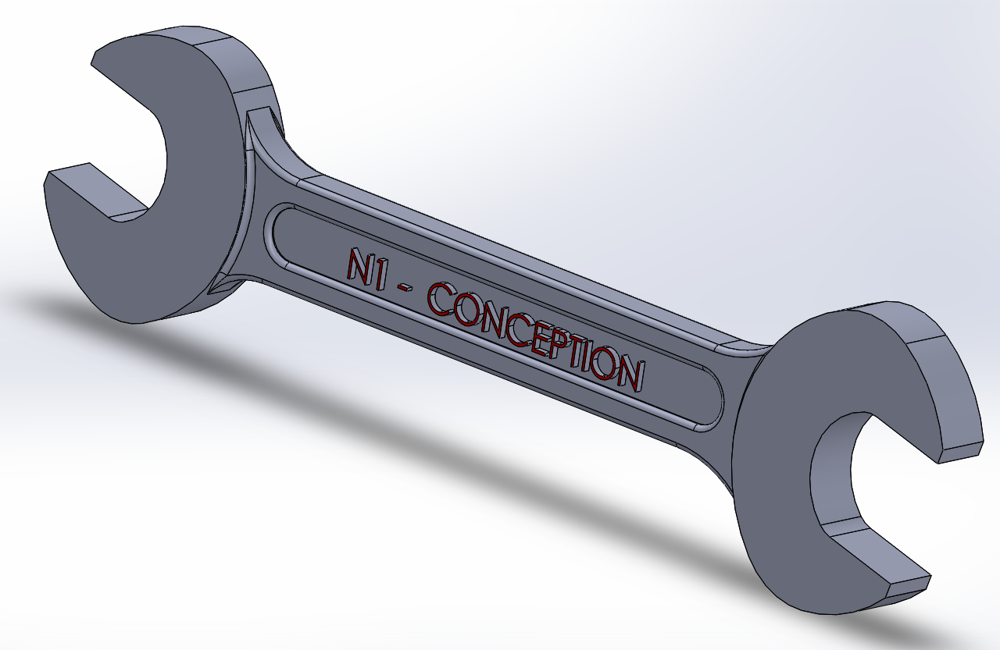

# Part-drawing-2-SW
This repository contains a 3D parametric model of a Spanner/Wrench, designed using SolidWorks. The model demonstrates clean surface design, text engraving, and precise dimensional constraints suitable for mechanical assembly applications.

---

Project Features

>Fully parametric spanner/wrench design

>Fully defined sketch

>Text engraving: "NI - CONCEPTION"

>Clean edges and chamfered surfaces for manufacturability

>Optimized for 3D printing, CNC machining, or simulation

---

Author

Nishchay Sharma

> B.Tech Mechanical Engineering | Lingaya’s Vidyapeeth (Gold Medalist)

Design Engineer |

---

Thank You for Viewing!

## File Include
- 'project02_nishchay.  SLDPRT' -
solidworks part file
## License
this project is licensed under the MIT license.

