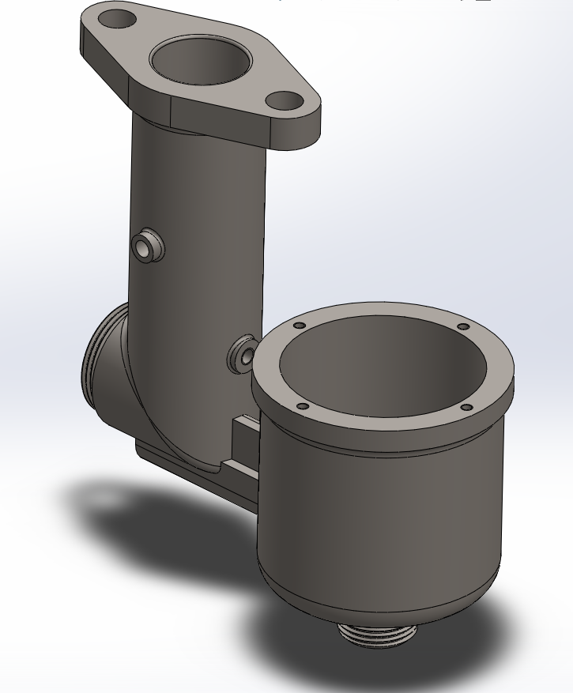
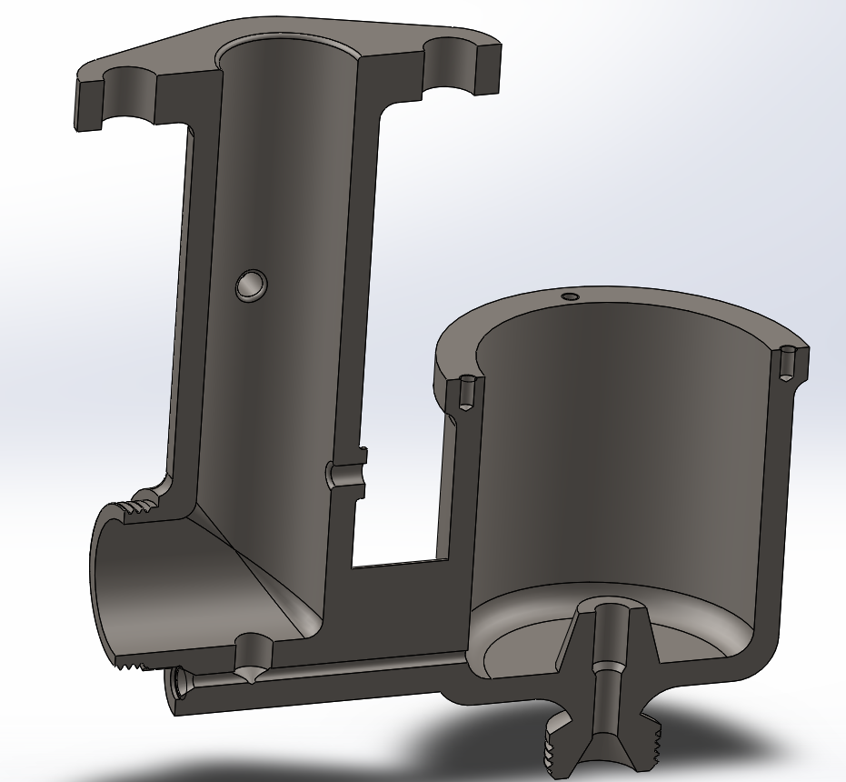
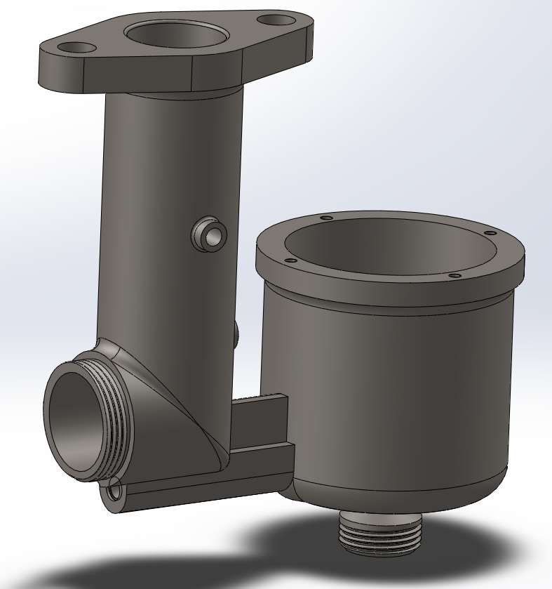

# Part-drawing-3-SW
Carburetor Body (3D CAD Model)

A detailed 3D CAD model of a Carburetor Body, designed for automotive engine applications. This component serves as the central housing for air-fuel mixing in carbureted engines, featuring ports for airflow, fuel inlet, and mounting flanges.

Features

Accurate Engineering Design

Developed with precise dimensions suitable for prototyping and manufacturing.

Assembly Ready

Includes mounting holes, flanged connections, and fuel/air passages for integration into a full carburetor assembly.

Parametric Modelling

Fully editable parametric design (created in SolidWorks) allowing easy modifications.

Applications

>Carbureted internal combustion engines (automotive & small engines)

>Educational projects and demonstrations

>Reverse engineering and prototyping

License

This project is licensed under the MIT License — feel free to use, modify, and share with attribution.

Author

Nishchay Sharma

>B.Tech Mechanical Engineering

>Gold Medalist | Design Engineer

Thank You for Viewing!

## File Include
- 'project03_nishchay.  SLDPRT' -
solidworks part file
## License
this project is licensed under the MIT license.
### Isometric View 1

###Section View

### Isometric View 2

