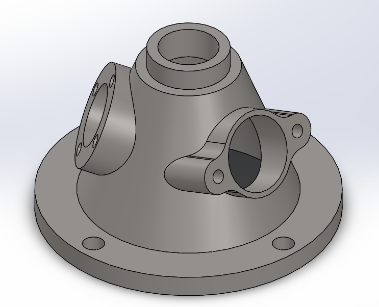

# Part-drawing-4-SW
Flanged Multi-Port Connector 

A detailed SolidWorks model of a Flanged Multi-Port Connector, designed for use in fluid or gas piping systems where multiple branch connections are required. The design demonstrates advance-level SolidWorks features including revolve, extrude, cut, fillet, and circular patterning.

Features-

>Main cylindrical inlet/outlet with precise bore and mounting interface.

>Two lateral branch ports with flange faces and bolt holes.

>Base flange with bolt circle pattern for secure mounting.

>Filleted edges for stress reduction and aesthetics.

>Suitable for casting, machining, or 3D printing applications.

>Design is fully defined.

Project Files

.SLDPRT file (SolidWorks Part)

Preview image of the 3D model

Applications

>Fluid piping manifolds

>Gas distribution systems

>Industrial machinery fittings

>Mechanical assemblies requiring multi-directional flow paths

Author

Nishchay Sharma

>B.Tech Mechanical Engineering

>Gold Medalist | Design Engineer

Thank You for Viewing!

## File Include
- 'project04_nishchay.  SLDPRT' -
solidworks part file
## License
this project is licensed under the MIT license.
### Isometric View 1

### Isometric View 2

