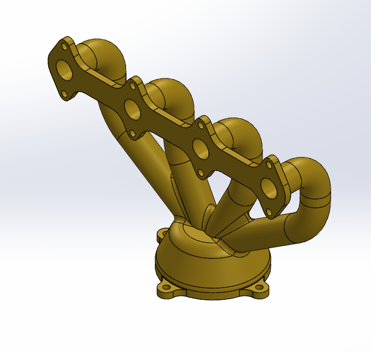
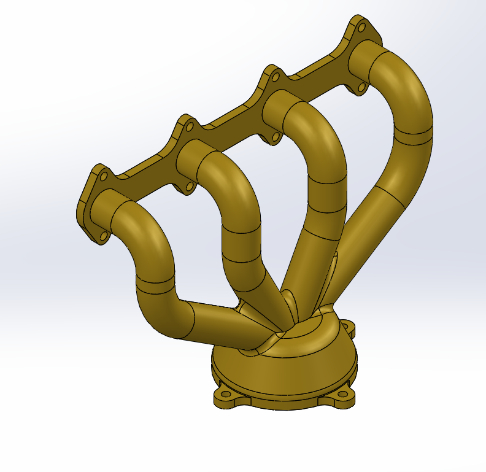
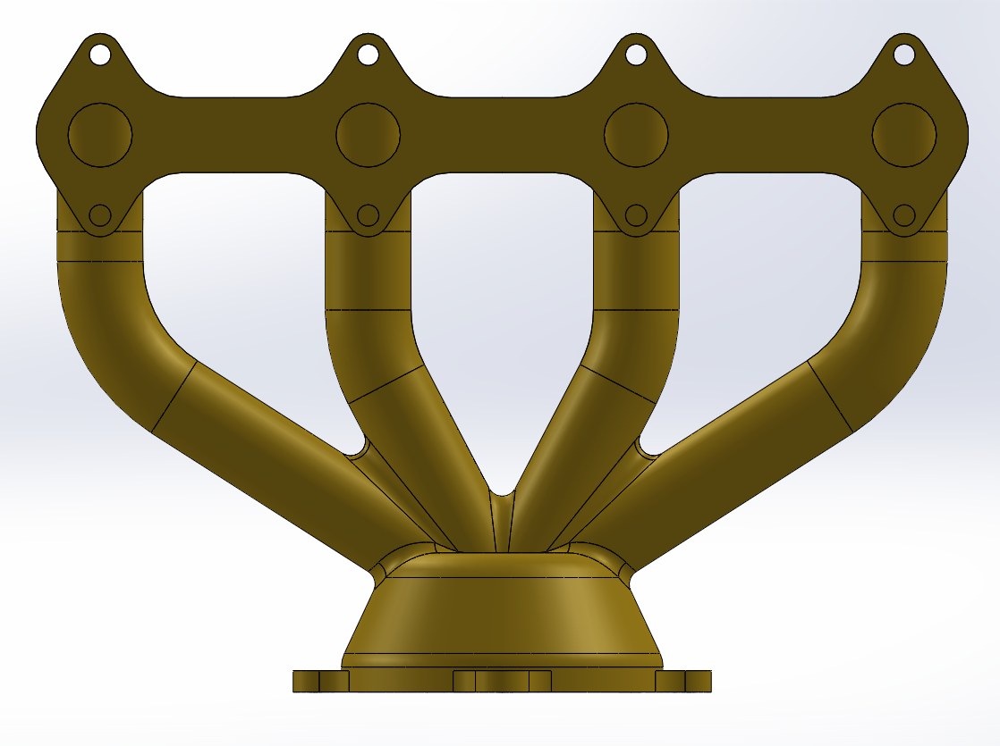

# Part-drawing-6-SW

# Exhaust Manifold — SolidWorks Design

## Overview

This repository contains a 3D CAD model of an *Exhaust Manifold* designed in *SolidWorks*.
  
The exhaust manifold is a crucial component in an internal combustion engine, responsible for collecting exhaust gases from multiple cylinders into a single pipe.

## Key Features

- 4-cylinder exhaust manifold geometry  

- Smooth runner profiles for optimized gas flow  

- Flange mounting holes for head attachment  

- Collector designed for efficient gas merging

## Applications

- Automotive engine design  

- Flow analysis and CFD simulations  

- Educational and training purposes in mechanical engineering

Parametric features: 

>Fully defined sketches and features for easy modification.

Requirements-

Software: SolidWorks 2018 or newer (Compatible with higher versions)

Skills: Advance SolidWorks user

Author-

Nishchay Sharma

>B.Tech Mechanical Engineering

>Gold Medalist | Design Engineer

  

## File Include
- 'project06_nishchay.  SLDPRT' -
solidworks part file
## License
this project is licensed under the MIT license.
### Isometric View 1

### Isometric View 2

### Front View

Thank You for Viewing!
