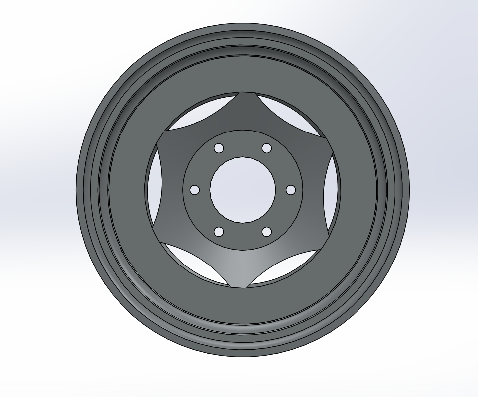

# Part-drawing-7-SW

# Vehicle Rim Design | SolidWorks Project

## Overview

This project showcases the 3D modeling and design of a *vehicle rim* created using *SolidWorks*. The design includes detailed features such as:

- Multi-layered rim profile

- Central mounting hub

- Bolt holes and air valve cavity

- Aesthetic cutouts for weight reduction

- *Techniques Used*:

  - Revolved Boss/Base

  - Cut-Extrude & Fillet

  - Reference Geometry: Planes and Sketches

  - Circular Pattern for bolt holes

  - RealView Graphics for rendering

## Project Goals

The goal of this model was to:

- Develop practical modeling skills in SolidWorks

- Simulate a real-world automotive component

- Apply mechanical design intent and symmetry

Author-

Nishchay Sharma

>B.Tech Mechanical Engineering

>Gold Medalist | Design Engineer

  

## File Include

- 'project07_nishchay.  SLDPRT' -
solidworks part file
## License

this project is licensed under the MIT license.

### Isometric View 

### Front View

Thank You for Viewing!
