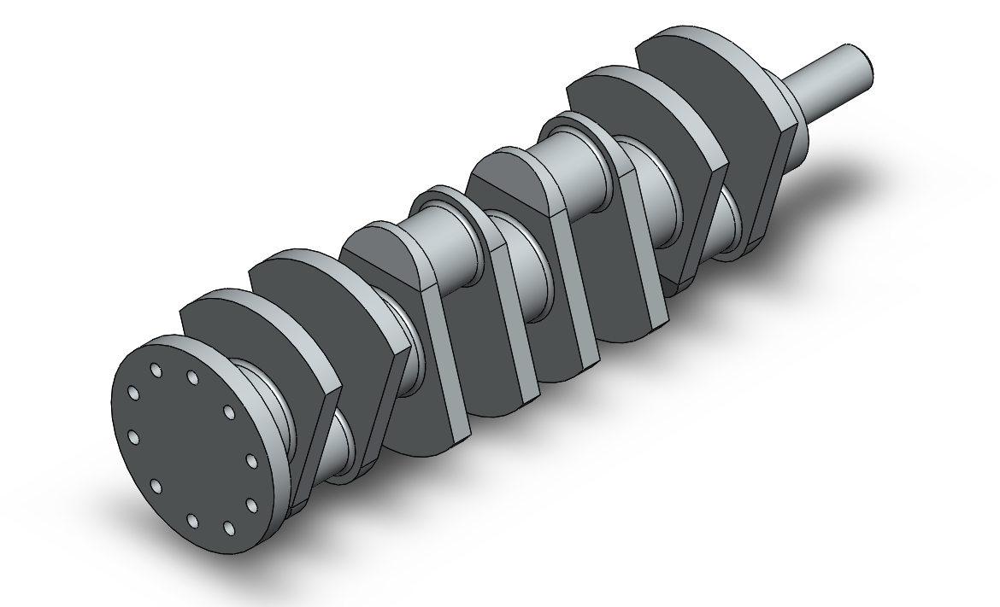
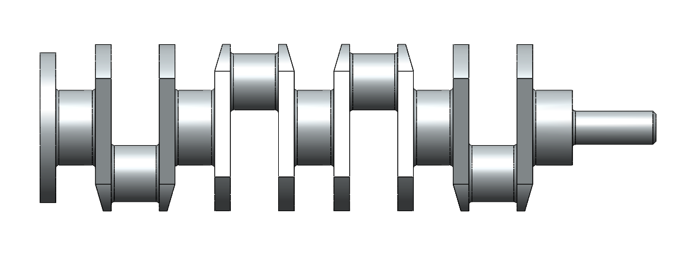

# Part-drawing-8-SW

# Crankshaft | SolidWorks 3D Model

This repository contains a 3D model of a *Crankshaft, designed using **SolidWorks*. The model demonstrates the mechanical structure and function of a crankshaft typically found in internal combustion engines, highlighting its role in converting linear piston motion into rotational motion.

## Features

- Fully parametric design

- Designed for manufacturing reference

- Follows real-world crankshaft geometry

- Includes main journals, crankpins, webs, and counterweights

## Software & File Info

- *File Type:* .SLDPRT (SolidWorks Part file)

- *Estimated Modeling Time:* ~2 hours

## Applications

- Internal Combustion Engine Design

- Mechanical Motion Simulation

- Educational Demonstration of Rotational Mechanisms

Author-

Nishchay Sharma

>B.Tech Mechanical Engineering

>Gold Medalist | Design Engineer

  

## File Include

- 'project08_nishchay.  SLDPRT' -
solidworks part file

## License

this project is licensed under the MIT license.

### Isometric View 

### Side View

Thank You for Viewing!
