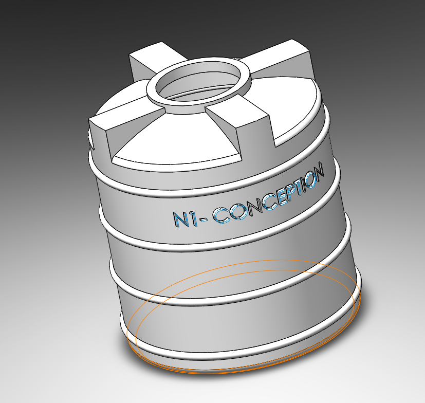
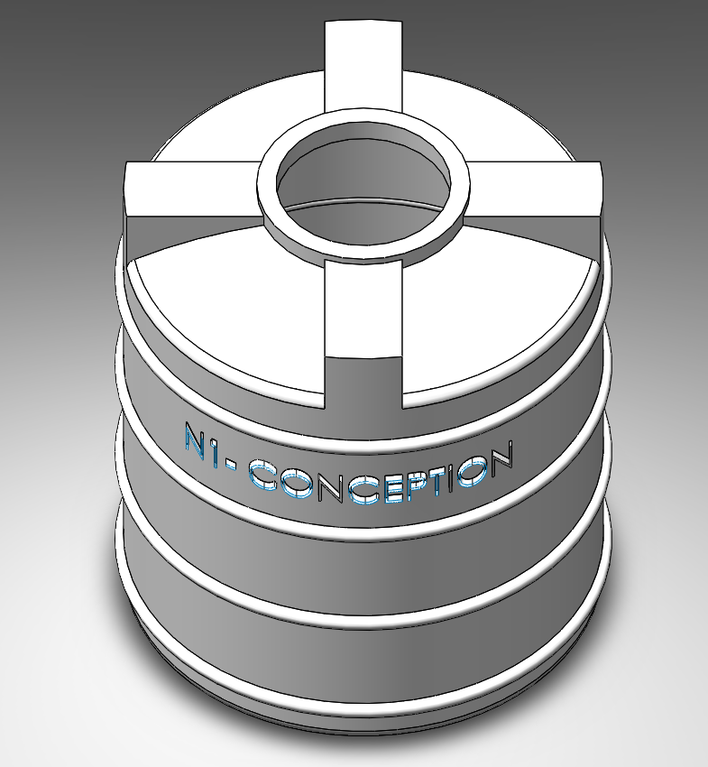
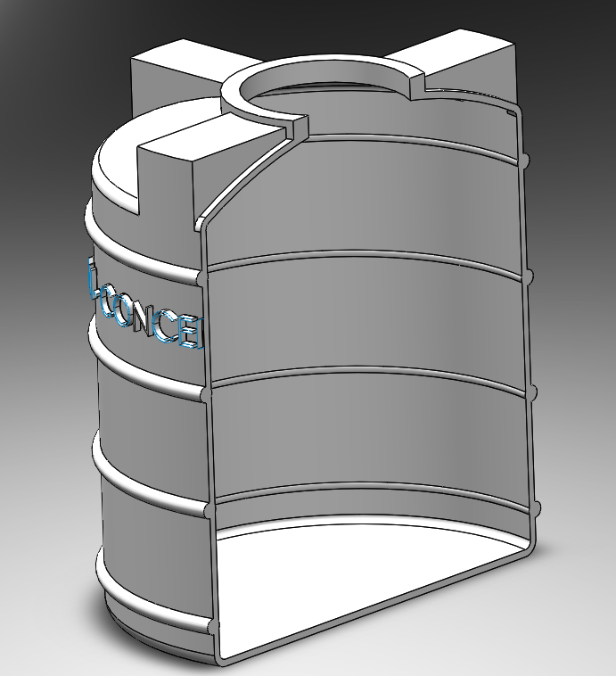

# Part-drawing-9-SW

# 💧 Water Tank CAD Model

This repository contains the 3D CAD design of a *Water Tank*, created using SolidWorks. The model is intended for use in design analysis, educational demonstrations, and mechanical drafting practice.

---

## 📂 Files Included

- Water_Tank.SLDPRT — SolidWorks Part File

- Water_Tank.PNG — Rendered Image of the Tank (Preview)

Author-

Nishchay Sharma

>B.Tech Mechanical Engineering

>Gold Medalist | Design Engineer

  

## File Include

- 'project09_nishchay.  SLDPRT' -
solidworks part file

## License

this project is licensed under the MIT license.

### Isometric View-I 

### Isometric View-II 

### Section View

Thank You for Viewing!
