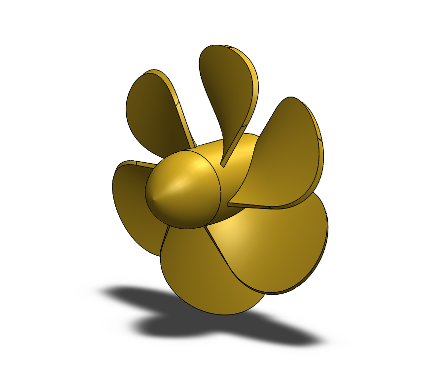
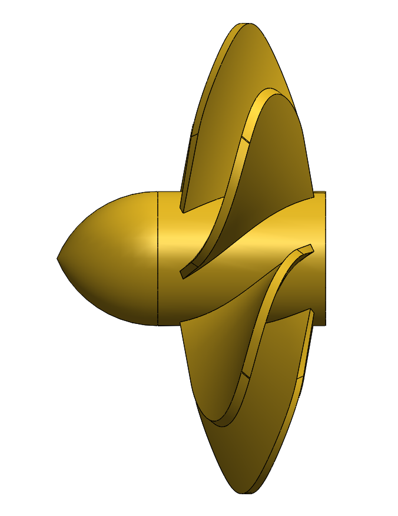

# Part-drawing-10-SW

# 🌀 Propeller CAD Model

This repository contains the 3D CAD model of a *Propeller, designed using **SolidWorks*. The model demonstrates the aerodynamic structure of a basic propeller, ideal for educational, simulation, or prototyping purposes in mechanical or aerospace engineering contexts.

---

## 🛠 Software Used

- 💻 *SolidWorks* (Version 2022 or later)

---

## 🎯 Design Highlights

- Three-blade symmetrical design

- Aerodynamic blade twist for improved thrust

- Center hub modeled with bore for shaft fit

- Parametric sketching for easy modifications

---

## 📌 Applications

- Educational demonstrations  

- 3D printing or prototyping

---

Author-

Nishchay Sharma

>B.Tech Mechanical Engineering

>Gold Medalist | Design Engineer

  

## File Include

- 'project10_nishchay.  SLDPRT' -
solidworks part file

## License

this project is licensed under the MIT license.

### Isometric View 

### Side View

### Section View

Thank You for Viewing!
