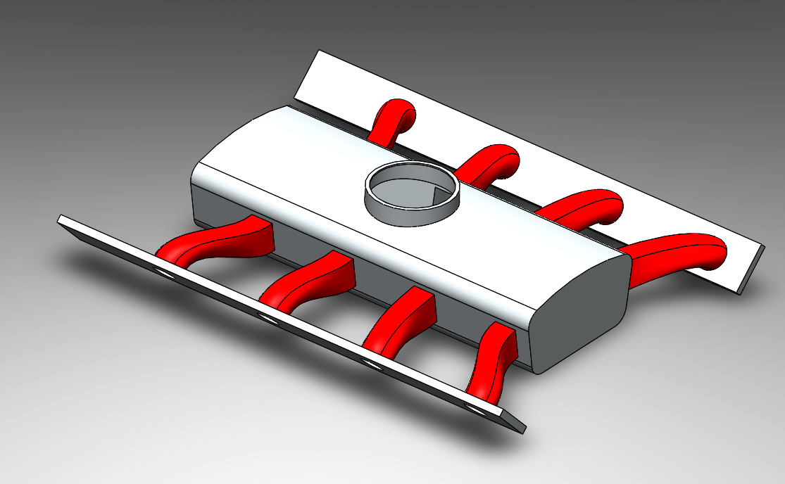
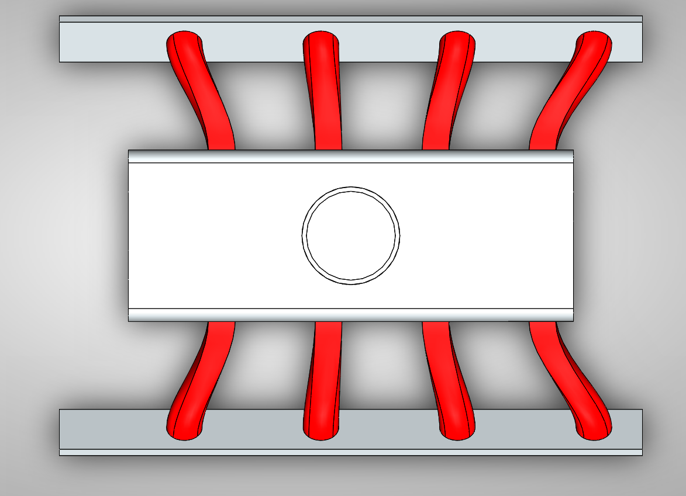

# Part-drawing-11-SW

🏁 V8 Engine Intake Manifold – CAD Model

📌 Project Overview

This project features a detailed Intake Manifold designed for a V8 engine configuration, created using SolidWorks. The intake manifold is a critical component in any internal combustion engine, responsible for evenly distributing the air-fuel mixture to the cylinders to ensure optimal performance, efficiency, and power delivery.

🔧 Design Objectives

Accurately model the geometry of a V8 intake manifold.

Ensure realistic airflow pathways and symmetrical plenum design.

Design suitable mounting points for throttle body and cylinder head connections.

Follow real-world proportions and design cues from performance engines.

🧩 Features

Dual-plane intake geometry

Eight equal-length runners for consistent airflow

Central plenum chamber with smoothed transitions

Mounting flanges for cylinder heads and throttle body

Designed with SolidWorks parametric modeling

📂 Files Included

V8_Intake_Manifold.SLDPRT – SolidWorks part file

V8_Intake_Manifold.STEP – Neutral format for cross-platform compatibility

README.md – Project documentation

preview.png – Rendered image of the model

🧠 Skills Demonstrated

3D CAD modeling and surfacing

Engineering design principles

Mechanical part visualization

Component symmetry and optimization

📌 Applications

Automotive engine simulations

Airflow analysis (CFD)

Educational demonstrations

Design portfolio projects

---

Author-

Nishchay Sharma

>B.Tech Mechanical Engineering

>Gold Medalist | Design Engineer

  

## File Include

- 'project11_nishchay.  SLDPRT' -
solidworks part file

## License

this project is licensed under the MIT license.

### Isometric View 

### Top View

Thank You for Viewing!
