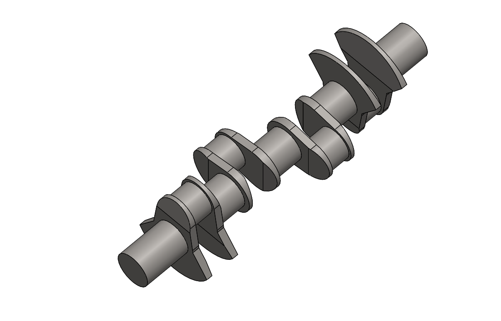

# Part-drawing-12-SW

# 🛠 V8 Crankshaft – SolidWorks Design

## 📌 Project Overview

This repository features a detailed *SolidWorks model of a V8 engine crankshaft*, designed for performance visualization, mechanical education, and CAD portfolio enhancement. The model demonstrates key engineering principles including journal offset, counterweights, and precision geometry found in high-performance internal combustion engines.

---

## ✨ Key Features

- Accurate 90° V8 firing configuration

- Balanced counterweight design

- Detailed journals for main and rod bearings

- Machined grooves and fillets for realism

- Engineered for animation and simulation in SolidWorks Motion.

---

## 🏅 Author

*Nishchay Sharma*  
Mechanical Engineer | Specializing in Design Engineering  
🔗 [LinkedIn](https://linkedin.com/in/yourprofile) • [GitHub](https://github.com/yourusername)

---

## 📝 License

This project is open-source under the [MIT License](LICENSE).

---

## ⭐ Show Your Support

If you find this project useful, consider starring ⭐ the repo or sharing it with others in the mechanical and CAD community!

Author-

Nishchay Sharma

>B.Tech Mechanical Engineering

>Gold Medalist | Design Engineer

  

## File Include

- 'project12_nishchay.  SLDPRT' -
solidworks part file

## License

this project is licensed under the MIT license.

### Isometric View 

Thank You for Viewing!
