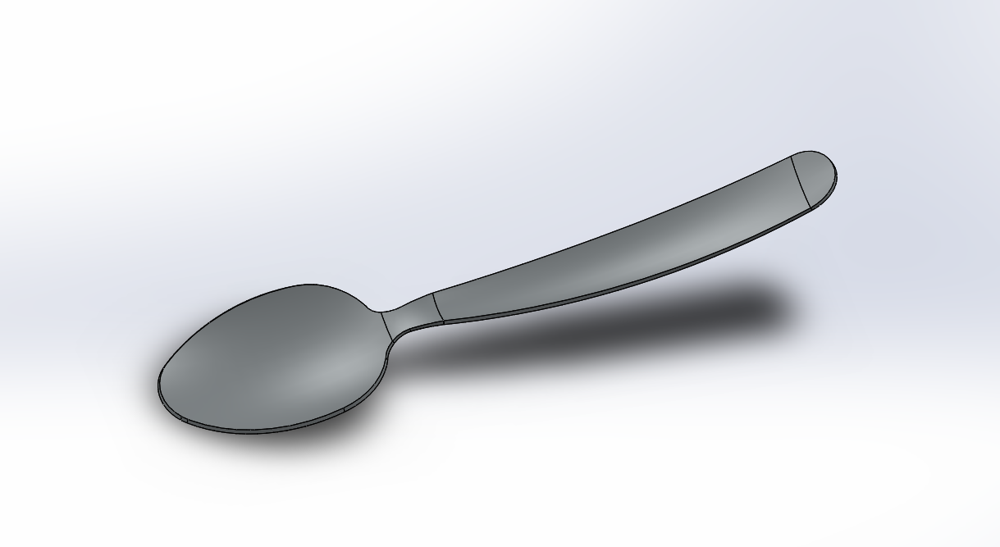
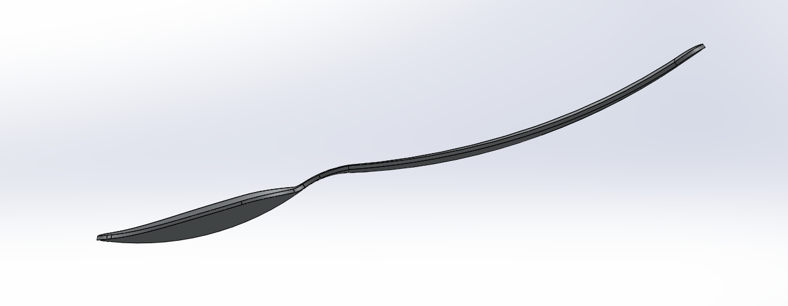

# Part-drawing-13-SW

# 🥄 SolidWorks Spoon Design

## 🚀 Project Overview

This repository hosts a fully parametric 3D spoon model crafted in SolidWorks (2018+).  
Ideal for education, ergonomic product design demos, or rendering-based workflows.

## 🔍 Features

- **Parametric Dimensions** – Easily adjust bowl depth, handle length, and curvature for custom sizes.  

- **Surface Modeling** – Employs lofts, boundary surfaces, and fillets for smooth transitions.  

- **Render-Ready** – Optimized for export to rendering engines (KeyShot, Blender, etc.).  

- **Learning Resource** – Great for SolidWorks learners exploring surface and feature-based modeling techniques.

## 🏅 Author

Nishchay Sharma

>B.Tech Mechanical Engineering

>Gold Medalist | Design Engineer

  

## File Include

- 'project13_nishchay.  SLDPRT' -
solidworks part file

## License

this project is licensed under the MIT license.

### Isometric View 

### Side View 

Thank You for Viewing!
