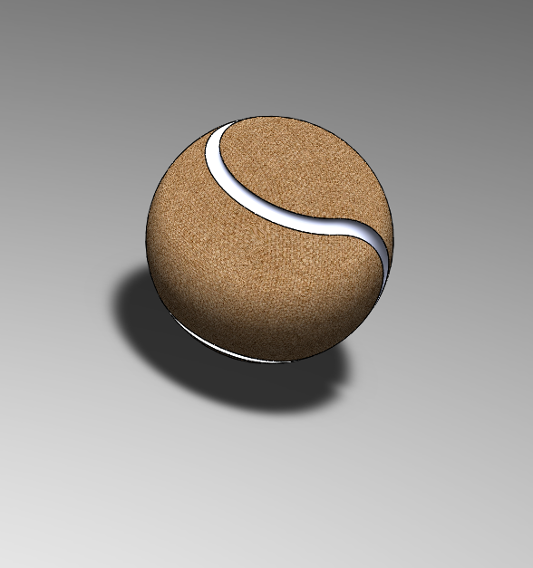

# Part-drawing-14-SW

# ⚙ SolidWorks Ball Design

## 🧰 Project Overview

This repository features a *3D SolidWorks model of a perfect ball* (sphere), crafted to showcase precision sketching, feature usage, and SolidWorks fundamentals. Ideal for beginners and intermediate designers seeking clarity on creating basic geometric bodies using parametric modeling.

---

## 📌 Features

- Fully parametric 3D model  

- Simple and clean design process  

- Created using *Revolve Boss/Base* 
 
- Suitable for simulation, rendering, or further assemblies  

---

## 🛠 Design Tools Used

- *Software:* SolidWorks 2023

## 🧪 Applications

- Basic design reference 
 
- Geometry practice  

- CAD teaching aid  

- Rendering practice  

---

## ⭐ Don't forget to leave a star if you liked this design!

## 🏅 Author

Nishchay Sharma

>B.Tech Mechanical Engineering

>Gold Medalist | Design Engineer

  

## File Include

- 'project14_nishchay.  SLDPRT' -
solidworks part file

## License

this project is licensed under the MIT license.

### Isometric View 

Thank You for Viewing!
