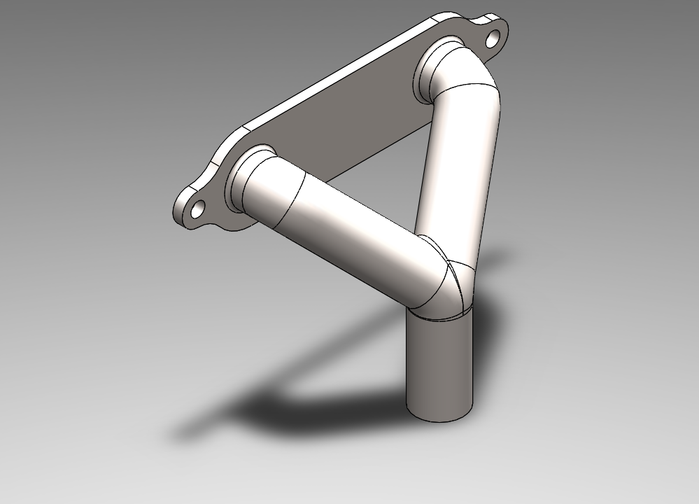
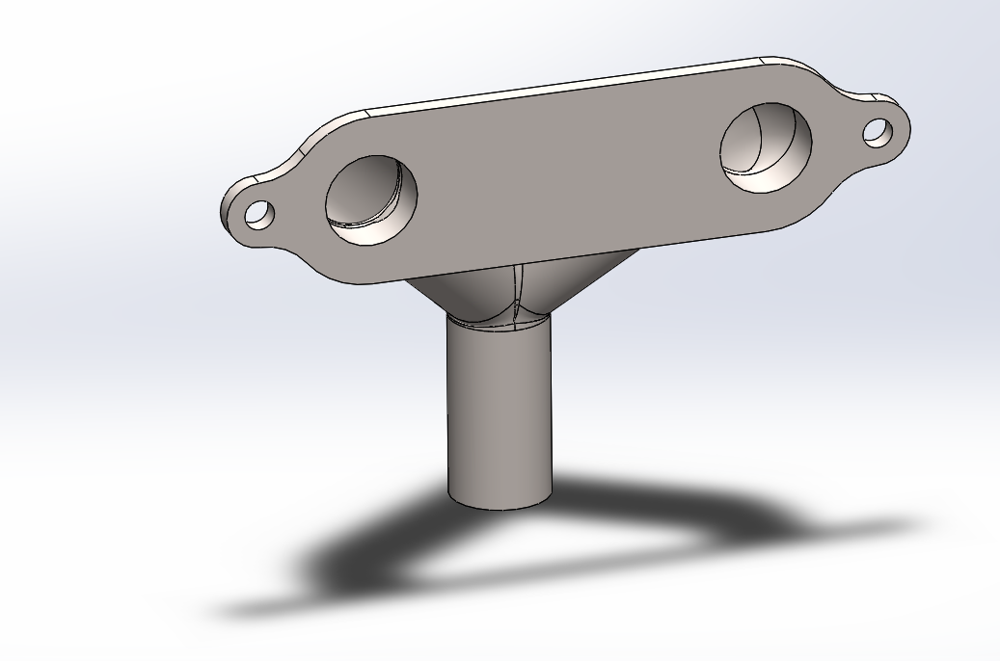

# Part-drawing-15-SW

# 🏍 Twin Cylinder Exhaust Pipe | SolidWorks Design  
Crafted by *N1 Conception*

---

## 📌 Overview  

This project features a detailed SolidWorks model of a *Twin Cylinder Exhaust Pipe* typically used in high-performance motorcycles. The design replicates real-world geometry, focusing on symmetry, flow optimization, and structural aesthetics.

---

## 🔧 Design Features  

- *Dual Exhaust Outlets* for twin-cylinder configuration 
 
- *Smooth Bends & Pipes* using swept boss/base and loft  

- *Accurate Pipe Couplings & Joints*  

- Designed for *efficient gas flow and noise reduction*  

- Realistic proportions based on reference data

---

## 📌 Applications  

- Concept visualization for automotive designs 
 
- Simulation base for exhaust flow analysis 
 
- 3D printing & prototyping  

- Portfolio showcase

## 🏅 Author

Nishchay Sharma

>B.Tech Mechanical Engineering

>Gold Medalist | Design Engineer

  

## File Include

- 'project15_nishchay.  SLDPRT' -
solidworks part file

## License

this project is licensed under the MIT license.

### Isometric View-I

### Isometric View-II 

Thank You for Viewing!
