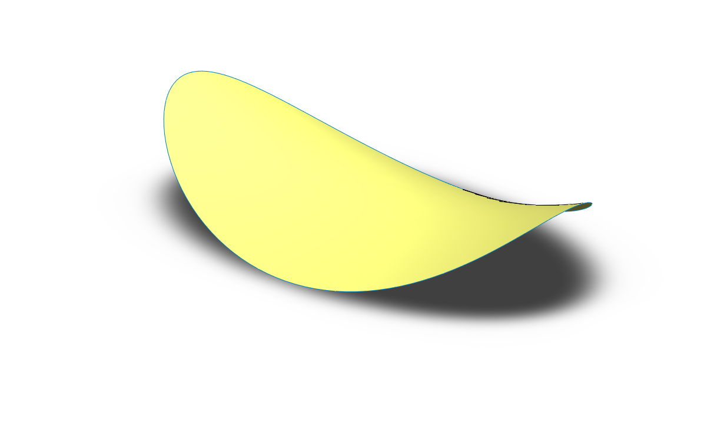
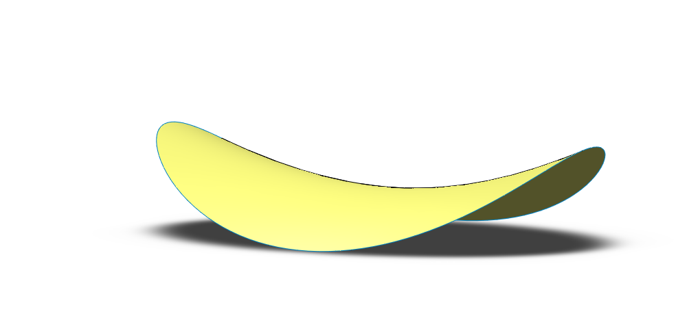

# Part-drawing-15-SW

# Curved Crisp Surface – SolidWorks Design

This SolidWorks model represents a smooth, curved thin surface inspired by the form of a potato chip or snack crisp.

## 🎯 Project Objective

To recreate the aesthetic and structural curvature of a crisp snack using advanced surface modeling techniques in SolidWorks.

## 🛠️ Tools & Features Used

- Surface Loft

- Guide Curves

- Boundary Surface

- Fillet/Edge smoothing

- Custom Render Settings

## 📦 Files Included

- `.SLDPRT` file of the model

- Rendered image preview

- README file

## 🧠 Design Inspiration

Inspired by the iconic shape of thin snack chips, this project focuses on mastering curvature and surface tension realism.

## 📷 Render Details

- Lighting: Soft Studio Lights

- Background: Matte White

- Material: Custom Glossy Plastic (Chip Yellow)

---

**Note**: This design is an original creation and not affiliated with any snack brand or product.

## 🏅 Author

Nishchay Sharma

>B.Tech Mechanical Engineering

>Gold Medalist | Design Engineer

  

## File Include

- 'project15_nishchay.  SLDPRT' -
solidworks part file

## License

this project is licensed under the MIT license.

### Isometric View 

### Side View 

Thank You for Viewing!
